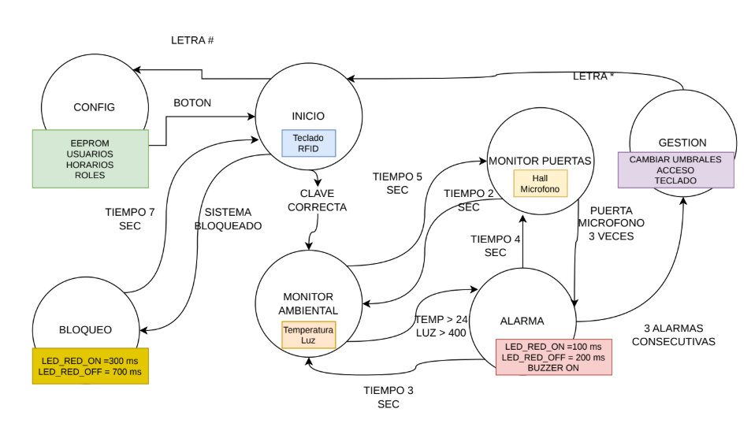

# Sistema de confort termico con Arduino

Este repositorio almacena el codigo fuente del proyecto del laboratorio de arquitectura computacional. 

##  Descripcion general
Se trata de un proyecto de Arduino que busca monitorizar el ambiente de una sala, con control de acceso mediante una clave o autenticacion RFID.

El sistema funciona mediante una automata finita que cambia de un estado a otro a partir de condicionales que pueden requerir la intervencion del usuario, o que pueden darse gracias a las mediciones de los distintos sensores con los que se trabaja.

### Grafico de la automata diseñada

## Hardware

El proyecto se armo con los siguientes elementos:

+ Arduino Mega 2560.
+ LCD 16x2.
+ Potenciometro.
+ Button Config.
+ Servo.
+ RGB LED.
+ Sensor de temperatura analogo
+ Sensor de efecto hall analogo
+ Sensor de sonido analogo
+ Buzzer
+ lector RFID mfrc522 
+ Keypad de membrana

## Integrantes
+ Juan Jose Rodriguez Prada
+ Leyder Ceron Muñoz
+ Sebastian Tintinago Pantoja

## DEMO YOUTUBE
https://youtube.com/shorts/TEMGOA_m_fs
